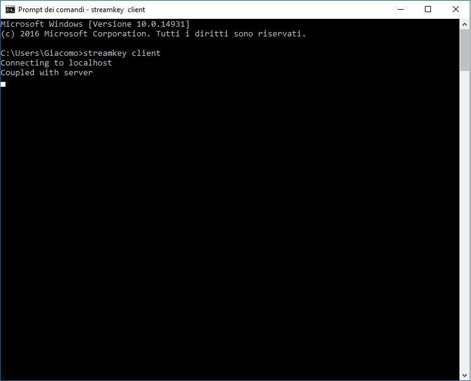
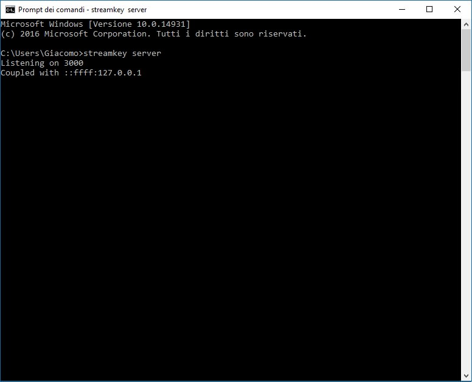

# StreamKey
### [Blog Post](http://blog.giacomocerquone.com/StreamKey-stream-your-keyboard/)
StreamKey is an application to stream a keyboard of one PC to another (through websockets)

## Screenshots
| Client                                                     | Server                                                 |
| ---------------------------------------------------------- | :----------------------------------------------------: |
|      |  |

## Caveats
Two problems that StreamKey have (due to robotjs lib):
- When an application is fullscreen on windows, streamkey doesn't correctly simulate key strokes ().
- Some particular letters (with accents for example) are not pressed ().

## Installation
Give `npm install -g streamkey` on both computers.

## Usage
1a. Give `streamkey server` on the PC that hasn't a keyboard 
1b. Give `streamkey client -i <local-ip-of-your-server>` on the PC that has got a keyboard

## License
Released under the MIT license. 
If you distribute a copy or make a fork of the project, I'd like you to credit this project as source. 
Copyleft 2016, Giacomo cerquone.
